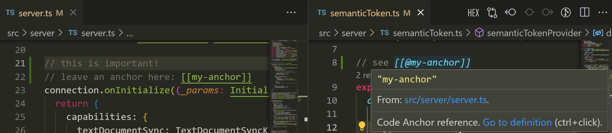

# Code Anchor for VSCode

[](https://marketplace.visualstudio.com/items?itemName=DiscreteTom.code-anchor)


Quickly navigate to anchors in your code.



## Installation

Via VSCode Marketplace: [Code Anchor](https://marketplace.visualstudio.com/items?itemName=DiscreteTom.code-anchor).

## Features

- Syntax highlighting for anchors and references.
- Completion for references.
- Hover for details.
- Goto definition.
- Find all references.
- Rename definitions.
- Show all definitions in side bar.
- Diagnostics for unused, undefined and duplicated definitions.
- [Customizable](#customize).
- Fast. Powered by [`ripgrep`](https://github.com/BurntSushi/ripgrep).

## Usage

Create a definition/anchor in any file using the following syntax:

```
[[some words here]]
```

Then reference it in any file:

```
[[@some words here]]
```

> [!NOTE]
> Files in `.gitignore` are ignored.

## Customize

These options are customizable via VSCode's settings.

- Definition pattern.
- Reference pattern.
- Completion prefix pattern.
- Completion trigger characters.
- Diagnostic severity.
- Whether to allow unused definitions.
- Update file debounce latency.

## Credit

Inspired by [bimark](https://github.com/DiscreteTom/bimark).

## [CHANGELOG](./CHANGELOG.md)
